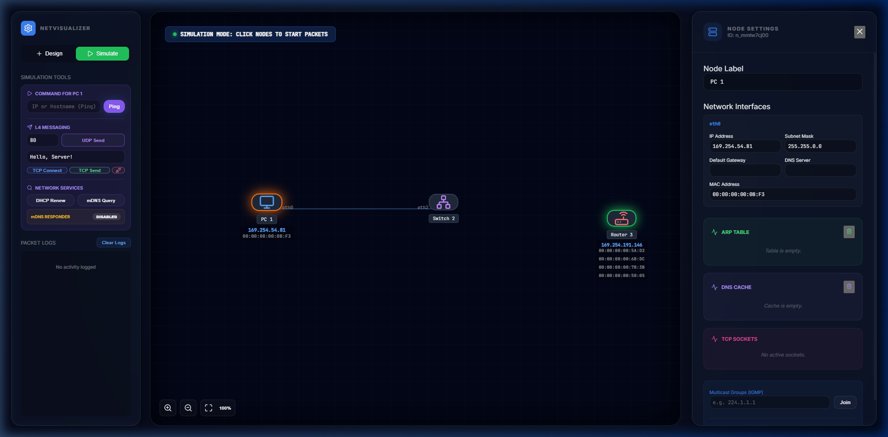

# NetVisualizer

**NetVisualizer** is a modern, interactive network simulator designed for beginners to explore and understand the fundamentals of the TCP/IP protocol suite. Through a high-fidelity visual interface, users can build virtual networks and observe real-time packet flow, protocol handshakes, and network services.



## 🌟 Key Features

### 📡 Visual Network Building
- **Interactive Canvas**: Drag and drop network nodes (PCs, Servers, Switches, Routers, and Hubs).
- **Dynamic Linking**: Connect nodes with virtual Ethernet cables and manage multiple interfaces.
- **Node Configuration**: Manually configure IP addresses, subnet masks, and default gateways, or use automated services.

### 🔬 Real-time Protocol Simulation
- **ICMP (Ping)**: Visualize reachability checks and observe ARP requests for next-hop resolution.
- **L4 Messaging (TCP/UDP)**:
  - **TCP**: Experience the 3-way handshake (SYN, SYN-ACK, ACK) and connection lifecycle.
  - **UDP**: Send datagrams and observe silent drops or ICMP Port Unreachable errors based on RFC standards.
- **Network Services**:
  - **DHCP**: Watch the DORA process (Discover, Offer, Request, Ack) in action.
  - **DNS**: Resolve hostnames and observe the DNS cache in real-time.

### 🔊 Advanced Multicast Support
- **IGMP Snooping**: Observe how switches intelligently forward multicast traffic only to interested ports.
- **Explicit Join/Leave**: Manually join multicast groups and see the node's membership status.
- **mDNS Responder**: Enable mDNS on any node to resolve local hostnames without a central DNS server.

### 📚 Pedagogical Insights
- **Live Tables**: View ARP tables, MAC tables, IGMP snooping tables, and DNS caches as they update dynamically.
- **RFC Compliance**: Simulation logic is strictly aligned with networking standards (RFC 1112, 1122, 2131, 4607, 6762, etc.).
- **Detailed Packet Logs**: Inspect every event with color-coded logs for successful delivery, errors, and silent drops.

---

## 🚀 Getting Started

### Prerequisites
- [Node.js](https://nodejs.org/) (v18 or higher recommended)
- [npm](https://www.npmjs.com/)

### Installation
1. Clone the repository:
   ```bash
   git clone https://github.com/Mono-Gen/NetVisualizer.git
   cd NetVisualizer
   ```
2. Install dependencies:
   ```bash
   npm install
   ```

### Running the App
- **Development Mode**:
  ```bash
  npm run dev
  ```
  Then open `http://localhost:5173` in your browser.
- **Desktop (Electron) Mode**:
  ```bash
  npm run electron:dev
  ```

### Building for Production
- **Web Build**:
  ```bash
  npm run build
  ```
- **Portable Desktop App (Windows)**:
  ```bash
  npm run electron:build
  ```
  The portable `.exe` will be generated in the `dist_electron` directory.

---

## 🛠 Tech Stack
- **Frontend**: React, TypeScript, Vite
- **Styling**: Vanilla CSS (Modern aesthetic with Dark Mode)
- **Desktop**: Electron
- **Bundler**: Vite, Electron-Builder

## 📜 License
This project is licensed under the MIT License - see the [LICENSE](LICENSE) file for details.

---
*Created for network students and curious learners to demystify the invisible layers of the internet.*
